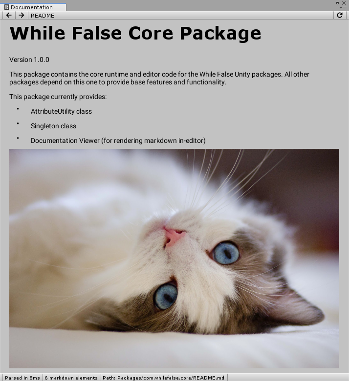

# Documentation Viewer



The documentation viewer is an editor window for viewing the documentation files shipped with the WFS Unity packages.

It can be used via API:
```csharp
using WhileFalse.Core;
...
Documentation.Open("Packages/[your package name here]/path/to/docs.md");
```

It is designed for showing instructional material on using new editor features provided by the packages. We can embed help buttons in the UI that open relevant documentation pages without leaving the editor.

It supports the more basic Markdown features currently. The list is:
- Paragraphs
- Ordered and unordered lists
- Code formatting
- Images (can be local or online)
- Links (local or online)

## Extending
TODO
DocsElement, MarkdownElementAttribute