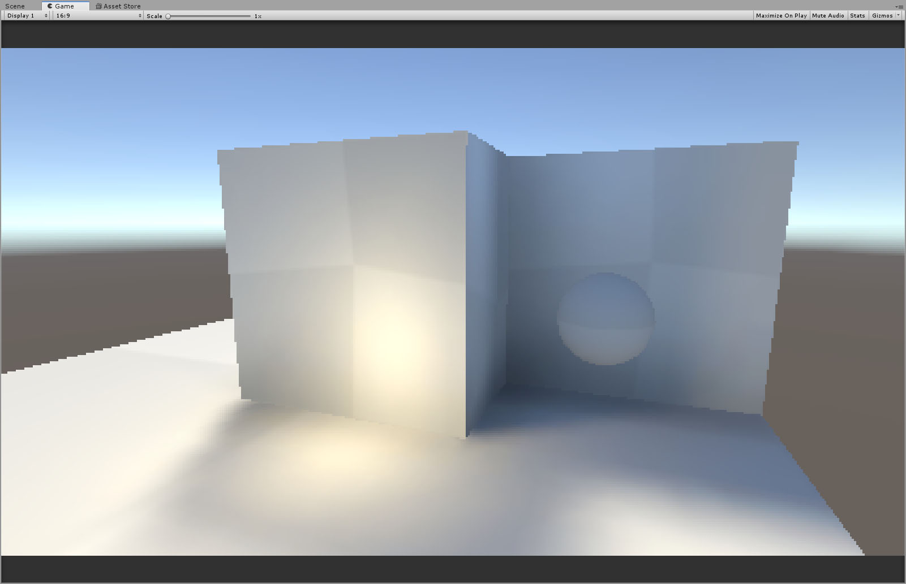

# Retro3D Render Pipeline - Extended
*Version 1.0.0*

This package provides an extended version of [keijiro's Retro3D Render Pipeline](https://github.com/keijiro/Retro3DPipeline), implementing more features and improvements over the original version. 

These include:
- Transparency and masked rendering
- Skybox rendering
- Baked lightmap support using Baked Indirect mode
- Dynamic shading for non-lightmapped objects using Spherical Harmonics
- Per-material cubemaps
- Viewmodel rendering
* More customisability, including:
    - Rendering resolution
    - Vertex precision simulation
    - Togglable perspective correction

